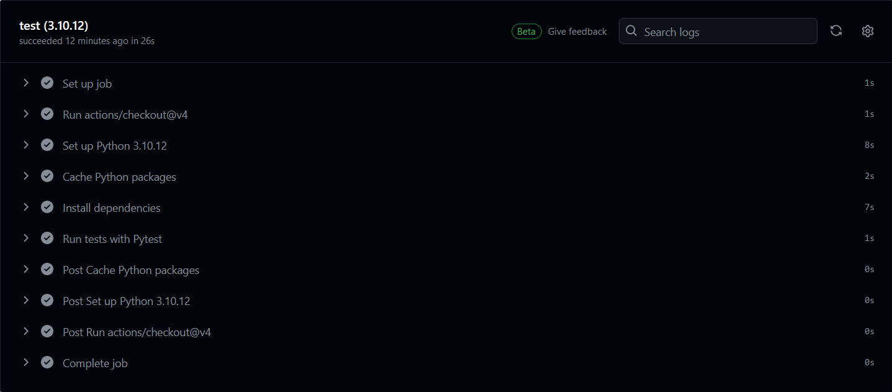
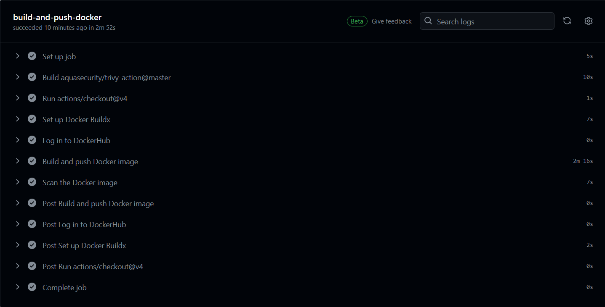
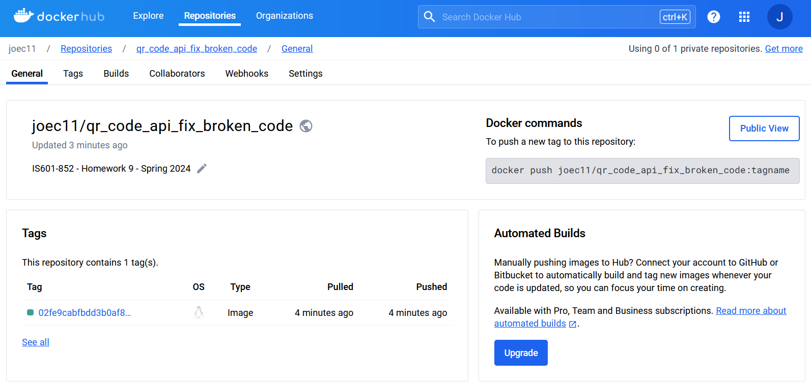

# Homework 9

## Successful test job

## Successful build and push docker images to DockerHub from GitHub using GitHub Actions

## Create a DockerHub repository from GitHub after using GitHub Actions to build and push docker images to DockerHub

## Link to the DockerHub repository and the docker images
https://hub.docker.com/r/joec11/qr_code_api_fix_broken_code/tags
